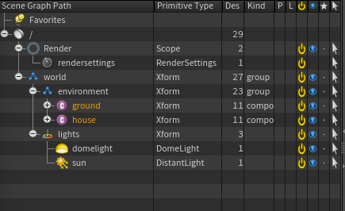

# What is USD?

## Overview

In simple terms USD is a common ground for artists to save and share 3D models, animation and scenes. It helps keep everything organised, and seamlessly integrate with softwares that supports USD.

::: tip TIP :sparkles:
Imagine you're building with LEGOs, each brick has its own shape, color, and position. In a 3D scene, those "LEGO bricks" are objects like characters, environments, and lights.

Saving a USD file is like sharing the instruction manual that tells the software exactly how everything fits together.
:::

## Structure

### Primitives everywhere!

USD is composed of a hierarchy of elements, each member of that hierarchy is called a **Primitive**, or **Prim** for close friends! They can be anything really—sometimes a piece of geometry, maybe a transform, or other times a light.

::: tip TIP :sparkles:
They are the individual bricks in our LEGO analogy.
:::

They can represent all kind of data for example:

#### Geometry

Meshes, transforms, curves, points, nurbs.

#### Shading

Shading nodes (file, noise ...), material node (principled shader)

#### Render Data

Render settings, render elements (called rendervars in USD)

---

Each of those primitives, in addition to having a type, can contain **Attributes** and **Relationship**, wich are collectively referred to as **Properties**
